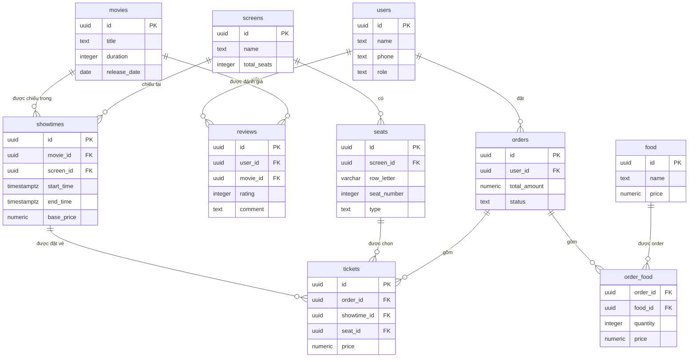

# Mô tả Database — Hệ thống bán vé xem phim

Tài liệu này mô tả toàn bộ cấu trúc database hiện có: các bảng, các cột, và quan hệ giữa chúng. Mục tiêu là để một người mới vào dự án đọc xong hiểu được luồng dữ liệu mà không cần hỏi lại.

---

## 1. Tổng quan

Database gồm **10 bảng**, chia làm 4 nhóm chức năng:

| Nhóm | Bảng | Mô tả |
|---|---|---|
| Người dùng | `users` | Tài khoản, phân quyền |
| Danh mục phim | `movies`, `reviews` | Thông tin phim, đánh giá |
| Lịch chiếu | `screens`, `seats`, `showtimes` | Phòng chiếu, ghế, suất chiếu |
| Đặt vé & đơn hàng | `food`, `orders`, `tickets`, `order_food` | Đồ ăn, đơn hàng, vé đã đặt |

Ý tưởng tổng thể: một **user** đặt một **order**, order gồm nhiều **ticket** (mỗi vé gắn với 1 ghế của 1 suất chiếu) và/hoặc nhiều món trong **order_food**.

---

## 2. Sơ đồ quan hệ (ERD)



> Ký hiệu: `||--o{` nghĩa là "1 - nhiều" (một bản ghi bên trái có thể liên kết với nhiều bản ghi bên phải).

---

## 3. Chi tiết từng bảng

### 3.1. `users` — Tài khoản người dùng
| Cột | Kiểu | Ràng buộc | Ghi chú |
|---|---|---|---|
| `id` | uuid | PK, FK → `auth.users(id)` | Dùng chung id với bảng auth (nếu dùng Supabase Auth) |
| `name` | text | NOT NULL | Tên hiển thị |
| `phone` | text | | Số điện thoại, có thể null |
| `role` | text | DEFAULT `customer`, CHECK IN (`admin`, `customer`) | Phân quyền |
| `created_at` | timestamptz | DEFAULT `now()` | |

**Quan hệ:** 1 user → nhiều `orders`, 1 user → nhiều `reviews`.

⚠️ **Lưu ý:** `id` tham chiếu tới `auth.users` — đây là bảng có sẵn của **Supabase Auth**. Nếu nhóm không dùng Supabase mà tự viết auth (JWT tự ký), cần bỏ FK này và để `users` tự sinh `id` (`uuid_generate_v4()`), đồng thời thêm cột lưu mật khẩu đã hash (VD `password_hash`) và `email`/`username` — hiện schema **chưa có cột nào để đăng nhập** (không có email/password). Đây là việc cần bổ sung trước khi code auth.

### 3.2. `movies` — Phim
| Cột | Kiểu | Ràng buộc | Ghi chú |
|---|---|---|---|
| `id` | uuid | PK | |
| `title` | text | NOT NULL | |
| `description` | text | | |
| `duration` | integer | NOT NULL | Thời lượng (phút) |
| `release_date` | date | | |
| `poster_url` | text | | |
| `created_at` | timestamptz | DEFAULT `now()` | |

**Quan hệ:** 1 movie → nhiều `showtimes`, 1 movie → nhiều `reviews`.

### 3.3. `screens` — Phòng chiếu
| Cột | Kiểu | Ràng buộc | Ghi chú |
|---|---|---|---|
| `id` | uuid | PK | |
| `name` | text | NOT NULL | VD "Screen 1" |
| `total_seats` | integer | NOT NULL | Tổng số ghế (nên khớp với số dòng trong bảng `seats` của screen này — không có ràng buộc DB tự động đảm bảo, cần kiểm tra ở tầng service) |

**Quan hệ:** 1 screen → nhiều `seats`, 1 screen → nhiều `showtimes`.

### 3.4. `seats` — Ghế trong phòng chiếu
| Cột | Kiểu | Ràng buộc | Ghi chú |
|---|---|---|---|
| `id` | uuid | PK | |
| `screen_id` | uuid | NOT NULL, FK → `screens.id` | Ghế thuộc phòng nào |
| `row_letter` | varchar | NOT NULL | VD "A", "B" |
| `seat_number` | integer | NOT NULL | VD 1, 2, 3 |
| `type` | text | DEFAULT `standard`, CHECK IN (`standard`,`vip`,`sweetbox`) | Loại ghế, ảnh hưởng giá vé (xử lý ở service) |

**Quan hệ:** 1 seat thuộc 1 screen; 1 seat có thể xuất hiện trong nhiều `tickets` (nhưng chỉ tối đa 1 lần cho **cùng 1 suất chiếu** — xem lưu ý ở `tickets`).

⚠️ Không có ràng buộc UNIQUE `(screen_id, row_letter, seat_number)` — về lý thuyết có thể tạo trùng 2 ghế cùng vị trí trong 1 phòng. Nên cân nhắc thêm constraint này.

### 3.5. `showtimes` — Suất chiếu
| Cột | Kiểu | Ràng buộc | Ghi chú |
|---|---|---|---|
| `id` | uuid | PK | |
| `movie_id` | uuid | NOT NULL, FK → `movies.id` | Phim nào |
| `screen_id` | uuid | NOT NULL, FK → `screens.id` | Chiếu ở phòng nào |
| `start_time` | timestamptz | NOT NULL | |
| `end_time` | timestamptz | NOT NULL | |
| `base_price` | numeric | NOT NULL | Giá vé gốc (có thể nhân hệ số theo loại ghế) |

**Quan hệ:** 1 showtime → nhiều `tickets` (tối đa = số ghế của screen đó).

⚠️ Không có ràng buộc chống **trùng lịch chiếu cùng phòng** (2 showtime cùng `screen_id` với khoảng thời gian đè lên nhau). Cần validate ở tầng service khi tạo showtime.

### 3.6. `food` — Đồ ăn / thức uống
| Cột | Kiểu | Ràng buộc | Ghi chú |
|---|---|---|---|
| `id` | uuid | PK | |
| `name` | text | NOT NULL | |
| `description` | text | | |
| `price` | numeric | NOT NULL | |
| `image_url` | text | | |

**Quan hệ:** xuất hiện trong nhiều `order_food`.

### 3.7. `orders` — Đơn hàng
| Cột | Kiểu | Ràng buộc | Ghi chú |
|---|---|---|---|
| `id` | uuid | PK | |
| `user_id` | uuid | NOT NULL, FK → `users.id` | Ai đặt |
| `total_amount` | numeric | DEFAULT 0 | Tổng tiền = tổng `tickets.price` + tổng `order_food.price * quantity`, tính ở service khi tạo order |
| `status` | text | DEFAULT `pending`, CHECK IN (`pending`,`completed`,`cancelled`) | Trạng thái đơn |
| `created_at` | timestamptz | DEFAULT `now()` | |

**Quan hệ:** 1 order → nhiều `tickets`, 1 order → nhiều `order_food`. 1 order thuộc 1 user.

### 3.8. `tickets` — Vé đã đặt
| Cột | Kiểu | Ràng buộc | Ghi chú |
|---|---|---|---|
| `id` | uuid | PK | |
| `order_id` | uuid | NOT NULL, FK → `orders.id` | Vé thuộc đơn nào |
| `showtime_id` | uuid | NOT NULL, FK → `showtimes.id` | Vé cho suất chiếu nào |
| `seat_id` | uuid | NOT NULL, FK → `seats.id` | Vé cho ghế nào |
| `price` | numeric | NOT NULL | Giá vé thực tế tại thời điểm đặt (chốt giá, không đổi dù `showtimes.base_price` sau này đổi) |

**Quan hệ:** đây là bảng trung tâm nối `orders` ↔ `showtimes` ↔ `seats`. Mỗi dòng = "1 ghế cụ thể trong 1 suất chiếu cụ thể đã được bán trong đơn nào".

🚩 **Rủi ro quan trọng:** hiện **không có UNIQUE constraint trên `(showtime_id, seat_id)`**. Điều này có nghĩa là về mặt DB, 2 người có thể đặt trùng cùng 1 ghế cho cùng 1 suất chiếu mà không bị chặn — hệ thống phải tự kiểm tra bằng tay ở tầng service (trong transaction). Khuyến nghị: thêm

```sql
ALTER TABLE tickets ADD CONSTRAINT tickets_showtime_seat_unique UNIQUE (showtime_id, seat_id);
```
để DB tự chặn trùng ghế, tránh phụ thuộc hoàn toàn vào logic ứng dụng (an toàn hơn khi có nhiều request đồng thời).

### 3.9. `order_food` — Món ăn trong đơn hàng
| Cột | Kiểu | Ràng buộc | Ghi chú |
|---|---|---|---|
| `order_id` | uuid | PK (composite), FK → `orders.id` | |
| `food_id` | uuid | PK (composite), FK → `food.id` | |
| `quantity` | integer | DEFAULT 1 | |
| `price` | numeric | NOT NULL | Giá tại thời điểm đặt (chốt giá, giống `tickets.price`) |

Đây là bảng **many-to-many** giữa `orders` và `food`, có thêm thuộc tính `quantity` và `price` (bảng nối có dữ liệu — không phải many-to-many thuần).

**Khoá chính composite** `(order_id, food_id)` nghĩa là: trong 1 đơn hàng, mỗi món ăn chỉ xuất hiện **1 dòng duy nhất** (muốn mua 3 phần bắp rang thì để `quantity = 3`, không tạo 3 dòng).

### 3.10. `reviews` — Đánh giá phim
| Cột | Kiểu | Ràng buộc | Ghi chú |
|---|---|---|---|
| `id` | uuid | PK | |
| `user_id` | uuid | NOT NULL, FK → `users.id` | |
| `movie_id` | uuid | NOT NULL, FK → `movies.id` | |
| `rating` | integer | NOT NULL, CHECK 1–5 | |
| `comment` | text | | |
| `created_at` | timestamptz | DEFAULT `now()` | |

**Quan hệ:** 1 user có thể review nhiều movie, 1 movie có nhiều review từ nhiều user. Không có UNIQUE `(user_id, movie_id)` — về lý thuyết 1 user có thể review 1 phim nhiều lần. Nếu nghiệp vụ muốn giới hạn "mỗi user chỉ review 1 phim 1 lần", cần thêm constraint này hoặc kiểm tra ở service.

---

## 4. Luồng dữ liệu chính (để hiểu nhanh hệ thống)

**Luồng đặt vé (quan trọng nhất):**
1. User xem `movies` → chọn phim.
2. Xem `showtimes` của phim đó (join `screens` để biết phòng).
3. Xem `seats` của `screen_id` tương ứng, đối chiếu với `tickets` đã tồn tại cho `showtime_id` đó để biết ghế nào còn trống.
4. User chọn ghế + chọn món trong `food` (tuỳ chọn).
5. Backend tạo 1 dòng `orders` (status = `pending`), tạo nhiều dòng `tickets` (1 dòng/ghế) và nhiều dòng `order_food` (1 dòng/món), tất cả trong **1 transaction**.
6. Tính `total_amount` = tổng giá vé + tổng giá đồ ăn, cập nhật vào `orders`.
7. (Tuỳ hệ thống có thanh toán hay không) chuyển `status` sang `completed`.

**Luồng đánh giá:** user đã có tài khoản → viết `reviews` gắn với `movie_id`, không phụ thuộc đã từng đặt vé phim đó hay chưa (schema hiện tại không ràng buộc điều này).

---

## 5. Các điểm cần bổ sung trước khi code (checklist)

- [ ] Bảng `users` cần thêm cột đăng nhập (`email`, `password_hash`) nếu không dùng Supabase Auth.
- [ ] Thêm UNIQUE `(showtime_id, seat_id)` trên `tickets` để chặn đặt trùng ghế.
- [ ] Thêm UNIQUE `(screen_id, row_letter, seat_number)` trên `seats` để chặn trùng vị trí ghế.
- [ ] Cân nhắc validate (ở service, không phải DB) chống trùng lịch chiếu cùng phòng trong `showtimes`.
- [ ] Cân nhắc UNIQUE `(user_id, movie_id)` trên `reviews` nếu muốn giới hạn 1 user/1 review/1 phim.
